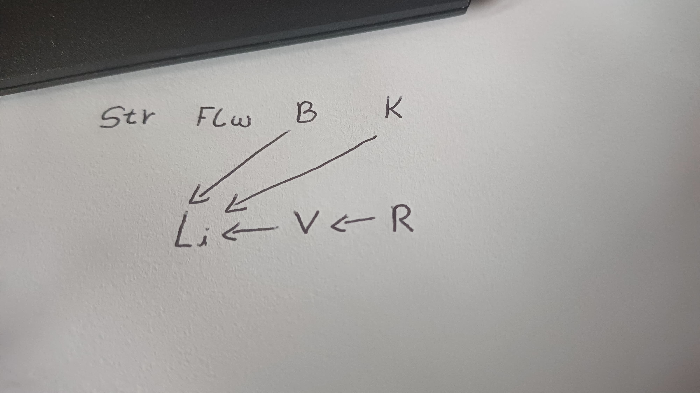

# 2o Trabalho : Raciocínio Probabilístico  
**João Victor Félix Guedes - 22050227**

Um sistema de diagnóstico deve ser feito para um farol de bicicleta movido a dínamo  
usando uma rede bayesiana. As variáveis na tabela a seguir são fornecidas:  
  

| Variável | Significado                                   | Valores                 |
|:--------:|:---------------------------------------------:|:-----------------------:|
|   Li     | Luz ligada (Light is on)                      |          t/f            |
|  Str     | Condição da rua (Street condition)            | dry, wet, snow\_covered  |
|  Flw     | Volante do Dínamo desgastado (Dynamo flywheel worn out) |         t/f            |
|   R      | Dínamo deslizante (Dynamo sliding)            |          t/f            |
|   V      | Dínamo mostra a tensão (Voltagem) (Dynamo shows voltage) |      t/f            |
|   B      | Lâmpada ok (Light bulb ok)                    |          t/f            |
|   K      | Cabo ok (Cable ok)                            |          t/f            |

As seguintes variáveis são independentes aos pares: Str, Flw, B, K. Além disso: (R, B), (R, K), (V,B), (V, K) são independentes e a seguinte equação é válida:
  
$P(Li \mid V, R) = P(Li \mid V)$  
$P(V \mid R, Str) = P(V \mid R)$  
$P(V \mid R, Flw) = P(V \mid R)$  
  
| $V$   | $B$   | $K$   | $P(Li)$ |  
|:-----:|:-----:|:-----:|:-------:|
| $t$   | $t$   | $t$   | 0.99    |
| $t$   | $t$   | $f$   | 0.01    |
| $t$   | $f$   | $t$   | 0.01    |
| $t$   | $f$   | $f$   | 0.001   |
| $f$   | $t$   | $t$   | 0.3     |
| $f$   | $t$   | $f$   | 0.005   |
| $f$   | $f$   | $t$   | 0.005   |
| $f$   | $f$   | $f$   | 0       |

# 1° Questão

# (a) Desenhe a rede causalidade entre as variáveis Str, Flw, R, V, B, K e Li

Str, Flw, B, K são **independentes entre si.**  
Além disso:  
R é **independente** de B e K  
V é **independente** de B e K  

$P(Li \mid V, R) = P(Li \mid V)$  → ou seja, Li depende só de V  
$P(V \mid R, Str) = P(V \mid R)$  → V depende só de R  
$P(V \mid R, Flw) = P(V \mid R)$  → **V não depende de Flw nem Str**  

A probabilidade condicional de Li depende de: V, B e K. 

# (b) Insira todos os CPTs faltantes no gráfico (tabela de probabilidades condicionais) e (c) Insira livremente valores plausíveis para as probabilidades.

**Str (Condição da rua):**

| Str           | $P(Str)$ |
|:-------------:|:--------:|
| dry           | 0.6      |
| wet           | 0.3      |
| snow\_covered | 0.1      |

**Flw (Volante do Dínamo desgastado):**

| Flw | $P(Flw)$ |
|:---:|:--------:|
| t   | 0.1      |
| f   | 0.9      |

**B – Lâmpada ok:**

| B | $P(B)$ |
|:-:|:------:|
| t | 0.95   |
| f | 0.05   |

**K – Cabo ok:**

| K | $P(K)$ |
|:-:|:------:|
| t | 0.97   |
| f | 0.03   |

**R – Dínamo deslizante:**

| $R$ | $P(R)$ |
|:---:|:------:|
| $t$ | 0.15   |
| $f$ | 0.85   |

**V – Dínamo gera tensão**  
Pai: R

| $R$ | $P(V = t)$ | $P(V = f)$ |
|:----:|:----------:|:----------:|
| $t$ | 0.2        | 0.8        | ← Dínamo deslizando → baixa geração de tensão  
| $f$ | 0.95       | 0.05       | ← Dínamo normal → tensão alta

# (d) Mostre que a rede não contém uma aresta (Str, Li).

A variável **Li** (*luz ligada*) depende **apenas de**:

- **V** (voltagem visível)  
- **B** (lâmpada ok)  
- **K** (cabo ok)  

Isto é dado **diretamente** pela **tabela de probabilidade condicional** de `Li`, que possui **apenas três pais**: `V`, `B` e `K`.

Foi explicitamente informado que:

$$
P(L_i \mid V, R) = P(L_i \mid V)
$$

Ou seja, **mesmo $R$ não afeta $Li$ diretamente**, apenas **indiretamente via $V$**.

Também foi fornecido que:

$$
P(V \mid R, Str) = P(V \mid R)
$$

Isso implica que:

- **$Str$ não afeta $V$** quando $R$ é conhecido.

Como:

- $Str$ **não influencia $V$ diretamente**
- $V$ é o **único intermediário** entre $Str$ e $Li$
- E **$Li$ não depende diretamente de $Str$**

Pode-se concluir:

$$
Li \perp Str \mid V
$$

Ou seja, **$Str$ e $Li$ são condicionalmente independentes dado $V$**. Logo:  

- **Não há dependência direta entre $Str$ e $Li$**
- **Nem estatística, nem causal**
- Portanto, **a aresta $Str \to Li$ não deve existir** na rede Bayesiana

(e) Calcule $P (V \mid Str = snow\_covered)$

Sabemos que:

- $V$ depende diretamente de $R$
- Possuímos:
  - $P(V \mid R)$
  - $P(R)$
  - E $R \perp Str$ implica:

$$
P(R, Str) = P(R) \cdot P(Str)
$$

Calcular:

$$
P(V = t \mid Str = \text{snow\_covered})
$$

**Expansão com a regra da soma total**

$$
P(V = t \mid Str = \text{snow\_covered}) = \sum_{r \in \{t, f\}} P(V = t \mid R = r) \cdot P(R = r \mid Str = \text{snow\_covered})
$$

Mas como \( R \) e \( Str \) são independentes:

$$
P(R = r \mid Str = s) = P(R = r)
$$

Portanto:

$$
P(V = t \mid Str = \text{snow\_covered}) = \sum_{r \in \{t, f\}} P(V = t \mid R = r) \cdot P(R = r)
$$

**Valores**

| $R$ | $P(R)$ | $P(V = t \mid R)$ |
|:---:|:------:|:-----------------:|
| $t$ | 0.15   | 0.20              |
| $f$ | 0.85   | 0.95              |

**Cálculo**

Aplicando:

$$
P(V = t \mid Str = \text{snow\_covered}) = (0.20 \cdot 0.15) + (0.95 \cdot 0.85)
$$

$$
= 0.03 + 0.8075 = 0.8375
$$

**Resposta final**

$$
P(V = t \mid Str = \text{snow\_covered}) = 0.8375
$$

# 2° Questão Implemente em ProbLog o problema da questão anterior e moste a solução para 1°(e).

Disponível em:  
['bicycle_Light.pl'](https://github.com/jjaoguedes/IA-2025-1/blob/main/trabalho2/bicycle_Light.pl)
